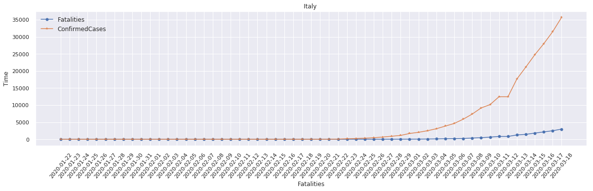
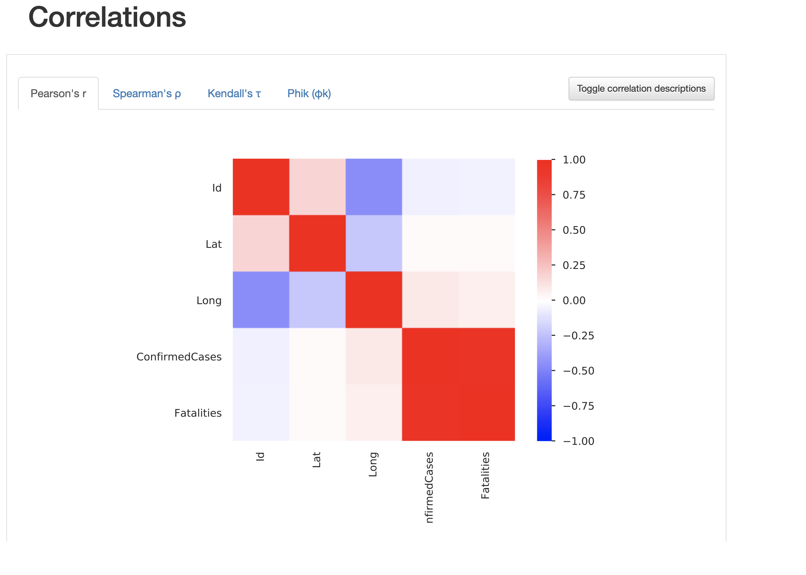
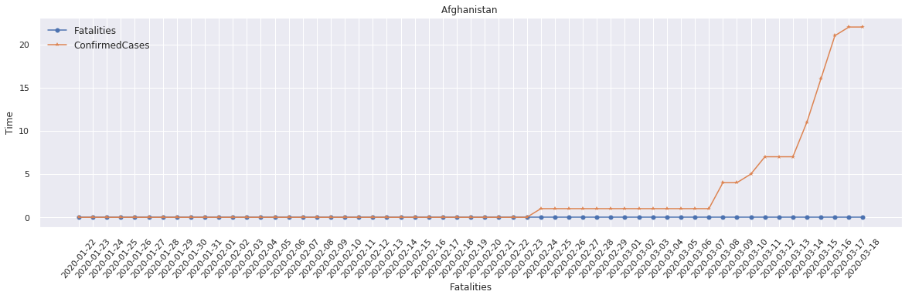
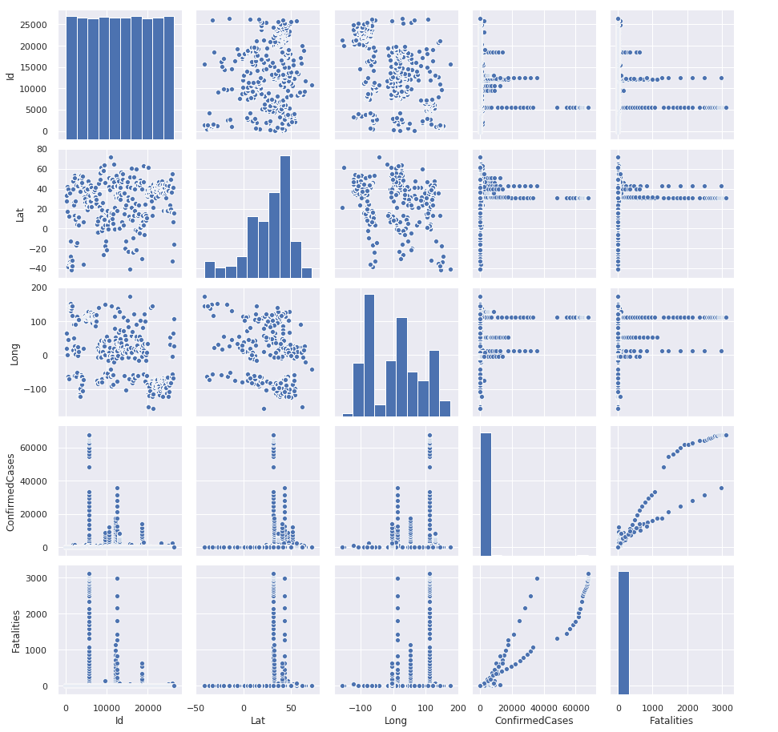

# COVID-19
COVID-19 EDA 
(work is going on)

#### This Repository shows the exploratory data analysis (EDA) of CVOID-19. using SNS, pandas, and Matplotlib. I have used Kaggle competition data during the analysis. ** Please find the Jupyter notebook here [**HERE**](https://nbviewer.jupyter.org/github/Sumit-ai/COVID-19/blob/master/eda-covid19-global-forecasting.ipynb)

 
 
 
 
 
