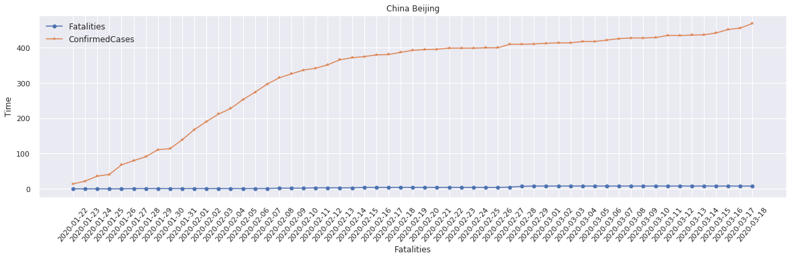

# COVID-19
COVID-19 EDA 
(work is going on)
-This Repository shows the exploratory data analysis (EDA) of CVOID-19. 
## Libraries: 
```
import seaborn 
import pandas 
import numpy
import matplotlib.pyplot 

```
## Dataset:
I have used Kaggle competition data during the analysis.

## Jupyter Notebook Code:
Please find the Jupyter notebook here [**HERE**](https://nbviewer.jupyter.org/github/Sumit-ai/COVID-19/blob/master/eda-covid19-global-forecasting.ipynb)

## Output results: 

 
 
 
